# RAFEEQ — مخطط قاعدة البيانات (ERD)

> **الغرض:** تشوف الـ 55 جدول وعلاقاتهم في صورة واحدة قبل ما نكتب أي migration.
> **التفاصيل الكاملة لكل عمود:** في `RAFEEQ_ENGINEERING_BIBLE.md` الجزء 4.
>
> رسمت المخطط **مقسّم على 14 مجموعة** بدل رسمة واحدة عملاقة — رسمة واحدة بـ 55 جدول
> مش هتقدر تقراها. وفيه في الآخر **خريطة العلاقات العابرة** بين المجموعات.

**إزاي تشوف الرسومات:** افتح الملف في VS Code واضغط `Ctrl+Shift+V` (المعاينة بترسم Mermaid تلقائيًا).

---

# 1. الخريطة العامة — 14 مجموعة وإزاي بتترابط

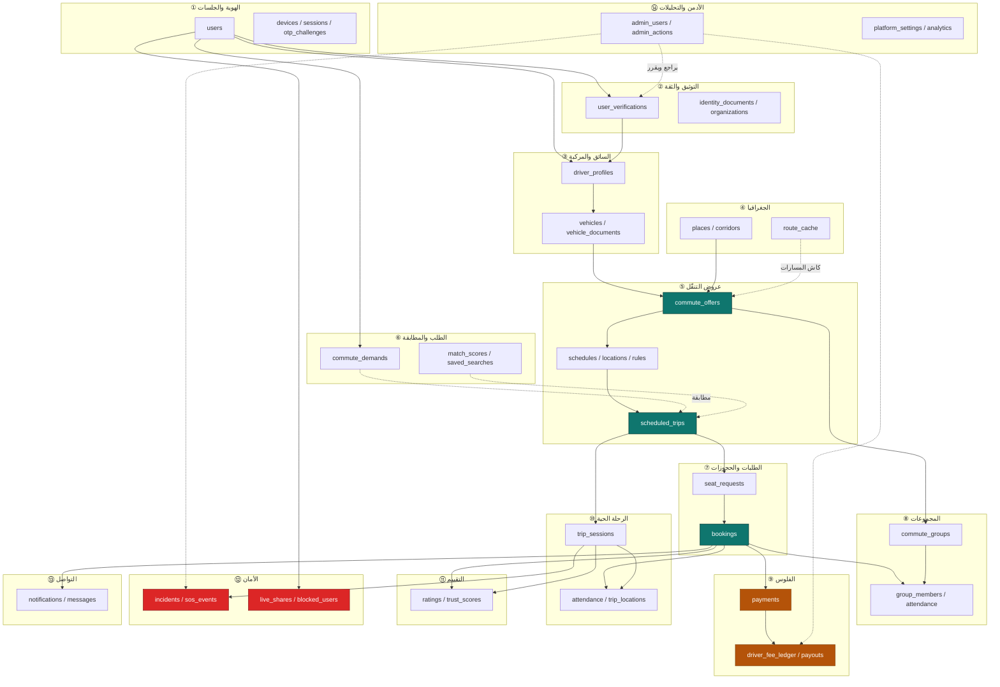

**اقرا الرسمة كده:** السهم المتصل = مفتاح أجنبي حقيقي. السهم المتقطع = علاقة منطقية
(مطابقة، مراجعة، كاش) مش بالضرورة FK.

---

# 2. العمود الفقري — من التسجيل للفلوس

دي أهم 10 جداول في المشروع. لو فهمت الرسمة دي، فهمت المنتج.

```mermaid
erDiagram
    users ||--o| driver_profiles : "may become a driver"
    driver_profiles ||--o{ vehicles : owns
    vehicles ||--o{ commute_offers : "used in"
    driver_profiles ||--o{ commute_offers : publishes
    commute_offers ||--|| commute_schedules : "recurs by"
    commute_offers ||--|| commute_groups : "forms"
    commute_schedules ||--o{ scheduled_trips : generates
    users ||--o{ seat_requests : sends
    commute_offers ||--o{ seat_requests : receives
    seat_requests ||--o| bookings : "becomes when approved"
    scheduled_trips ||--o{ bookings : "holds seats for"
    scheduled_trips ||--o| trip_sessions : "executed as"
    bookings ||--|| attendance : "tracked by"
    bookings ||--o{ payments : "charged via"
    bookings ||--o{ ratings : "reviewed in"

    users {
        ulid id PK
        varchar phone_e164 UK "login identity"
        varchar public_first_name "only this is public"
        varchar gender "hard filter, never exposed"
        varchar account_status
        tinyint trust_level "0 to 4"
    }
    driver_profiles {
        ulid user_id PK_FK "one per person"
        varchar status "approved needed to publish"
        varchar licence_number_hash "dup detection"
        date licence_expiry "checked before every trip"
    }
    vehicles {
        ulid id PK
        ulid driver_profile_id FK
        varchar plate_normalized UK "platform wide"
        tinyint seats "caps offer seats"
        boolean is_active "only one true"
    }
    commute_offers {
        ulid id PK
        ulid driver_profile_id FK
        ulid vehicle_id FK
        ulid corridor_id FK
        varchar status "draft published paused archived"
        tinyint seats_total
        int price_per_seat_piastres "piastres never float"
        varchar audience "women_only or any_verified"
        text route_polyline "computed once at publish"
        decimal bbox_min_lat "search index"
        decimal bbox_max_lat
        decimal bbox_min_lng
        decimal bbox_max_lng
    }
    commute_schedules {
        ulid id PK
        ulid commute_offer_id FK
        tinyint days_mask "bitmask sat=1 fri=64"
        time departure_time "LOCAL wall clock"
        varchar timezone "Africa/Cairo"
        date end_date "mandatory"
        date generated_until "rolling 30 day horizon"
    }
    scheduled_trips {
        ulid id PK
        ulid commute_offer_id FK
        date trip_date "UNIQUE with offer_id"
        timestamp departure_at "UTC computed at generation"
        tinyint seats_total "snapshot"
        tinyint seats_taken "the locked column"
        int price_snapshot_piastres
        varchar status
    }
    seat_requests {
        ulid id PK
        ulid passenger_user_id FK
        ulid commute_offer_id FK
        varchar commitment "trial or recurring"
        timestamp agreed_to_rules_at "mandatory"
        varchar payment_type "cash or online"
        varchar status "pending approved waitlisted"
        smallint waitlist_position
    }
    bookings {
        ulid id PK
        ulid scheduled_trip_id FK "UNIQUE with passenger"
        ulid passenger_user_id FK
        ulid commute_group_id FK
        int price_snapshot_piastres "frozen forever"
        int platform_fee_snapshot_piastres "frozen"
        int driver_amount_snapshot_piastres "frozen"
        varchar payment_type
        varchar status
    }
    trip_sessions {
        ulid id PK
        ulid scheduled_trip_id FK "one to one"
        timestamp started_at
        timestamp completed_at
        varchar current_status
        timestamp deviation_detected_at
    }
    attendance {
        ulid booking_id PK_FK
        varchar status "present late no_show"
        varchar confirmed_by "driver per decision D18"
        boolean gps_corroborated "evidence not proof"
        timestamp disputed_at "24h window"
    }
    payments {
        ulid id PK
        ulid booking_id FK
        varchar payment_type "cash or online"
        int amount_piastres
        int platform_fee_piastres
        int driver_amount_piastres
        varchar idempotency_key UK "double charge guard"
        varchar status
    }
    ratings {
        ulid id PK
        ulid booking_id FK
        ulid reviewer_user_id FK
        tinyint stars
        timestamp visible_at "null means hidden double blind"
    }
    commute_groups {
        ulid id PK
        ulid commute_offer_id FK "one to one"
        varchar name
        tinyint min_commitment_days_per_week
    }
```

## القراءة السردية للرسمة

```
شخص  ──(ممكن يبقى)──>  سائق  ──(بيملك)──>  عربية
                                              │
                                       (بينشر بيها)
                                              ▼
                                          عرض تنقّل
                                         ╱          ╲
                              (بيتكرر بـ)            (بيكوّن)
                                    ▼                    ▼
                                جدول تكرار          مجموعة ثابتة
                                    │                    ▲
                              (بيولّد)                    │
                                    ▼                    │
                            رحلات يومية  ◄──(بتحجز فيها)─┤
                                    │                    │
                                    │              ┌─────┴─────┐
                              (بتتنفذ كـ)          │  حجز مؤكد │
                                    ▼              └─────┬─────┘
                              جلسة رحلة                  │
                                    │           ┌────────┼────────┐
                              (بتسجّل)          ▼        ▼        ▼
                                    ▼        حضور     دفع     تقييم
                            مواقع GPS
```

---

# 3. مجموعة ① — الهوية والجلسات

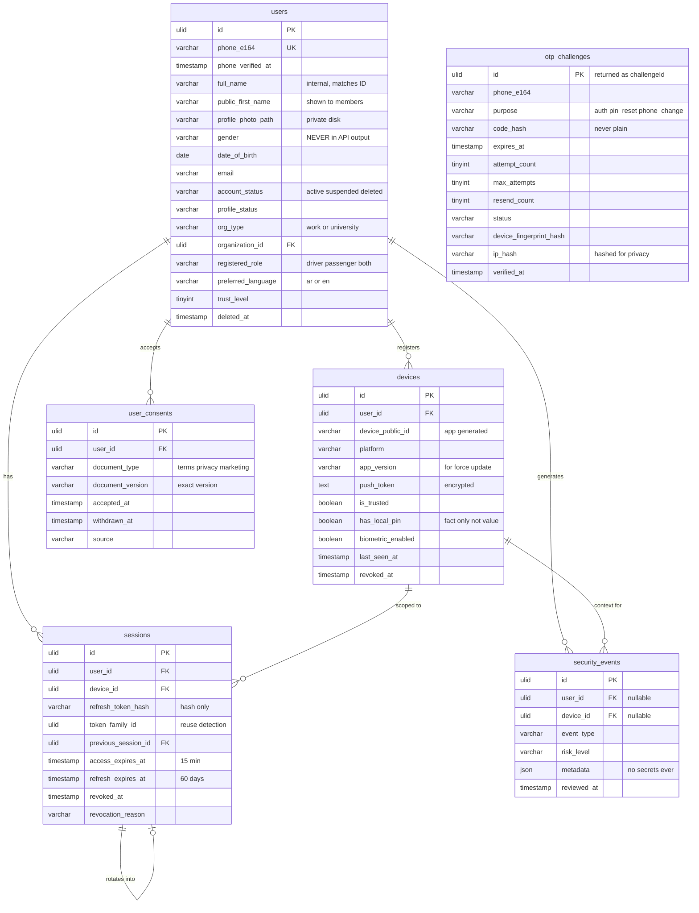

**ملاحظة على `otp_challenges`:** مالهاش FK لـ `users` **عن قصد** — لأنها بتتعمل
قبل ما نعرف إن الرقم ده له حساب أصلاً. الربط بيحصل بعد التحقق.

**ملاحظة على `sessions ||--o| sessions`:** دي علاقة ذاتية بتمثّل سلسلة التدوير.
كل تجديد بيعمل صف جديد بيشاور على القديم. كلهم بنفس `token_family_id`.

---

# 4. مجموعة ② — التوثيق والثقة

```mermaid
erDiagram
    users ||--o{ user_verifications : "must complete"
    users }o--o| organizations : "belongs to"
    user_verifications ||--o{ identity_documents : "backed by"
    admin_users ||--o{ user_verifications : reviews
    users ||--o| trust_scores : "scored by"

    organizations {
        ulid id PK
        varchar name
        varchar name_ar
        varchar type "work university school"
        varchar email_domain "enables auto verify"
        varchar city
        varchar district
        point location_point
        boolean is_verified
    }
    user_verifications {
        ulid id PK
        ulid user_id FK "UNIQUE with type"
        varchar type "phone government_id selfie organization"
        varchar status "pending approved rejected action_needed"
        varchar method "otp ocr_review email_domain badge_review"
        ulid reviewed_by FK
        timestamp reviewed_at
        varchar rejection_reason "must be actionable"
        timestamp expires_at
        tinyint attempt_count
    }
    identity_documents {
        ulid id PK
        ulid user_verification_id FK
        varchar kind "national_id_front selfie badge"
        varchar file_path "PRIVATE disk only"
        varchar file_hash "sha256 dedup and integrity"
        varchar mime_type
        int size_bytes
        json ocr_payload "encrypted"
        varchar virus_scan_status
        timestamp expires_at
        date purge_after "enforced by daily job"
    }
    trust_scores {
        ulid user_id PK_FK
        tinyint score "0-100 INTERNAL"
        varchar public_tier "new trusted highly_trusted"
        json components "score breakdown"
        timestamp computed_at
    }
```

**المستويات الأربعة بتتحسب من `user_verifications`:**
```
level = عدد الصفوف اللي status = 'approved'
  phone approved            → 1
  + government_id approved  → 2   ← بيفتح طلب المقاعد
  + selfie approved         → 3
  + organization approved   → 4   ← بيفتح فلتر "نفس الجامعة"
```

---

# 5. مجموعة ③ — السائق والمركبة

```mermaid
erDiagram
    users ||--o| driver_profiles : "one per person"
    driver_profiles ||--o{ vehicles : owns
    vehicles ||--o{ vehicle_documents : "documented by"
    admin_users ||--o{ verification_logs : writes
    driver_profiles ||--o{ verification_logs : "audited in"

    driver_profiles {
        ulid user_id PK_FK "UNIQUE one profile per user"
        varchar status "draft pending approved suspended expired_documents"
        varchar national_id_hash "search without decrypt"
        text national_id_encrypted
        varchar licence_number_hash
        text licence_number_encrypted
        date licence_expiry "daily job plus pre trip check"
        timestamp verified_at
        ulid reviewer_id FK
        varchar rejection_reason
        int completed_trips_count "denormalized"
        decimal cancellation_rate
        decimal on_time_rate
    }
    vehicles {
        ulid id PK
        ulid driver_profile_id FK
        varchar make
        varchar model
        smallint year
        varchar colour "helps recognition"
        varchar plate_number
        varchar plate_normalized UK "platform wide unique"
        tinyint seats "2 to 8"
        varchar transmission
        varchar fuel_type
        varchar photo_path
        boolean is_active "exactly one true per driver"
        varchar verification_status
    }
    vehicle_documents {
        ulid id PK
        ulid vehicle_id FK
        varchar type "registration insurance inspection"
        varchar file_path "private"
        varchar file_hash
        date expires_at
        varchar verification_status
        date purge_after
    }
    verification_logs {
        ulid id PK
        varchar entity_type
        ulid entity_id
        ulid admin_id FK
        varchar action "approve reject request_info suspend"
        json old_value
        json new_value
        varchar reason "mandatory on reject"
    }
```

> 🔒 `verification_logs` **INSERT فقط** — دفاعك القانوني لو حصل نزاع على قرار توثيق.

---

# 6. مجموعة ④ — الجغرافيا والمسارات

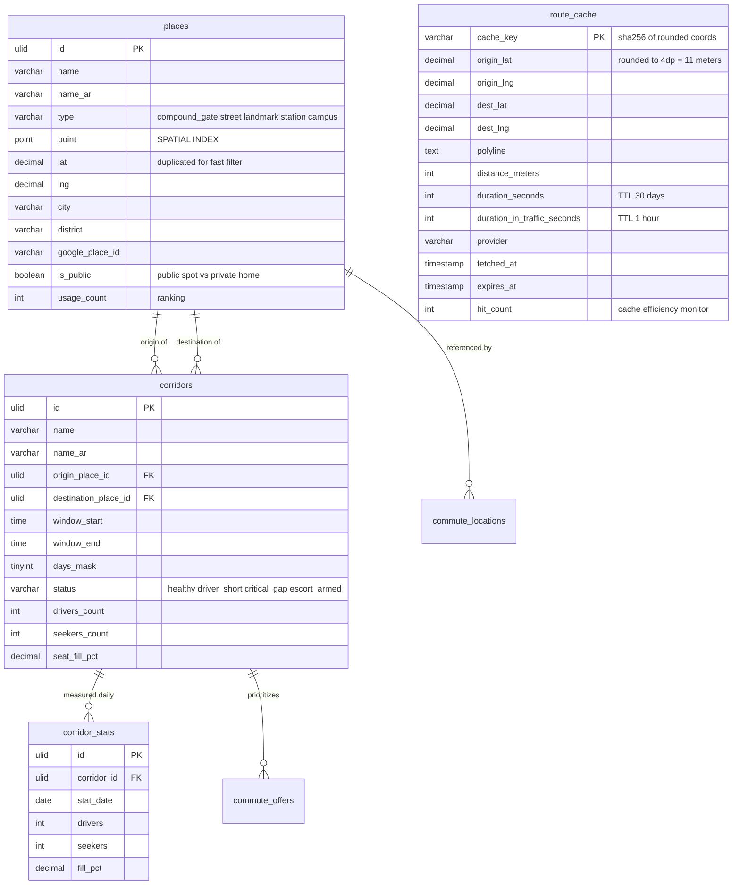

**`route_cache` مالهاش FK لأي حاجة** — دي طبقة تخزين مؤقت خالصة، بتتنضّف دوريًا،
ومفيش حاجة بتعتمد على وجود صف معيّن فيها.

---

# 7. مجموعة ⑤ — عروض التنقّل والرحلات المجدولة

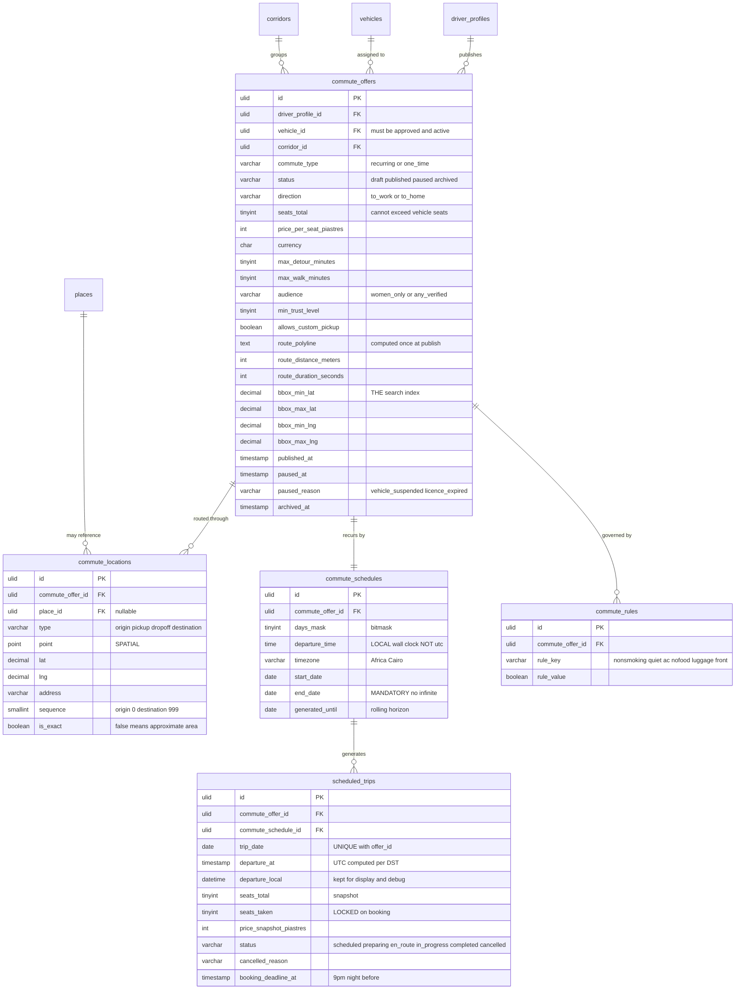

## آلة الحالة — العرض والرحلة

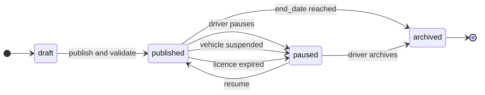

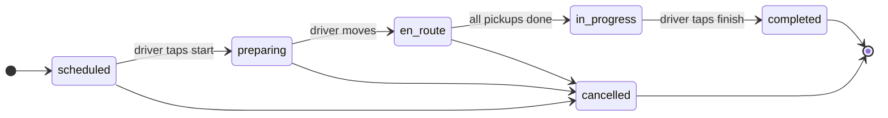

> ⚠️ **`scheduled_trips` هو الجدول اللي هيكبر أسرع من أي جدول تاني.**
> 5,000 عرض × 22 يوم عمل في الشهر = **110,000 صف شهريًا**.
> عشان كده: أفق توليد 30 يوم بس + أرشفة بعد 6 شهور.

---

# 8. مجموعة ⑥ — الطلب والمطابقة

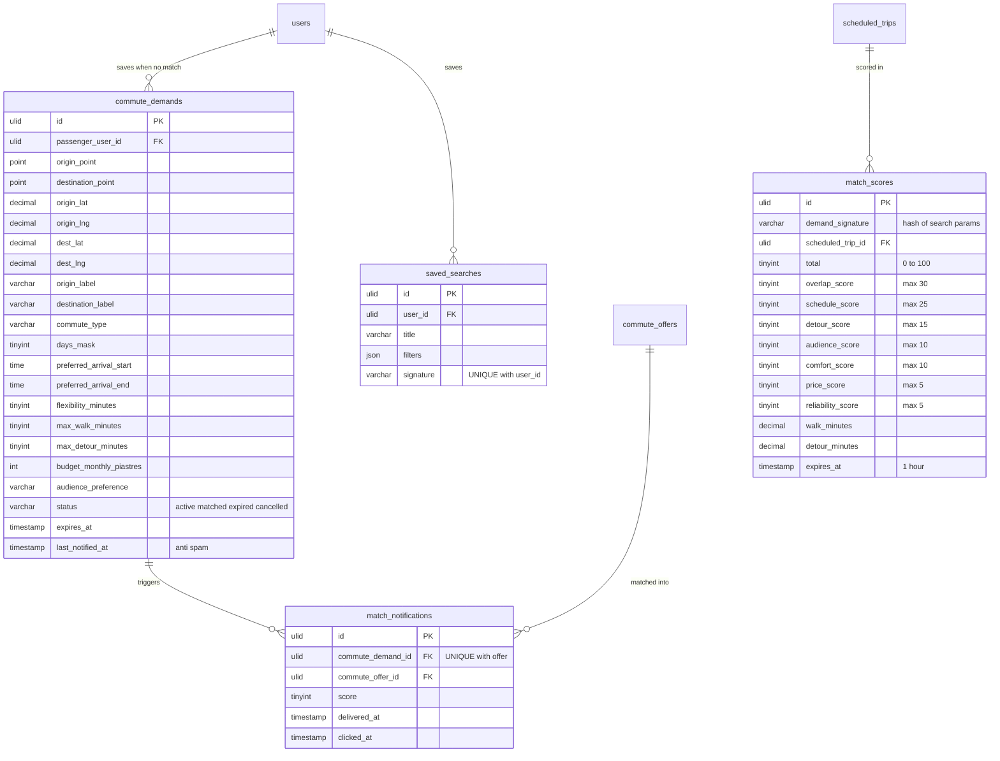

> 🔒 **`commute_demands` سري.** مفيش أي endpoint بيرجّع الجدول ده لأي سائقة.
> ده الفرق بين رفيق و"مزاد على الركاب". فيه اختبار إجباري بيتأكد من ده.

## خط أنابيب المطابقة

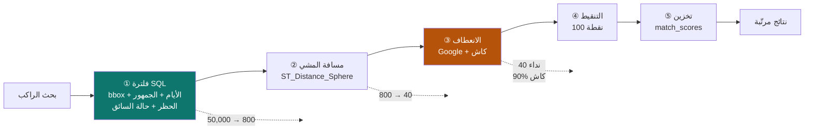

---

# 9. مجموعة ⑦ — طلبات المقاعد والحجوزات

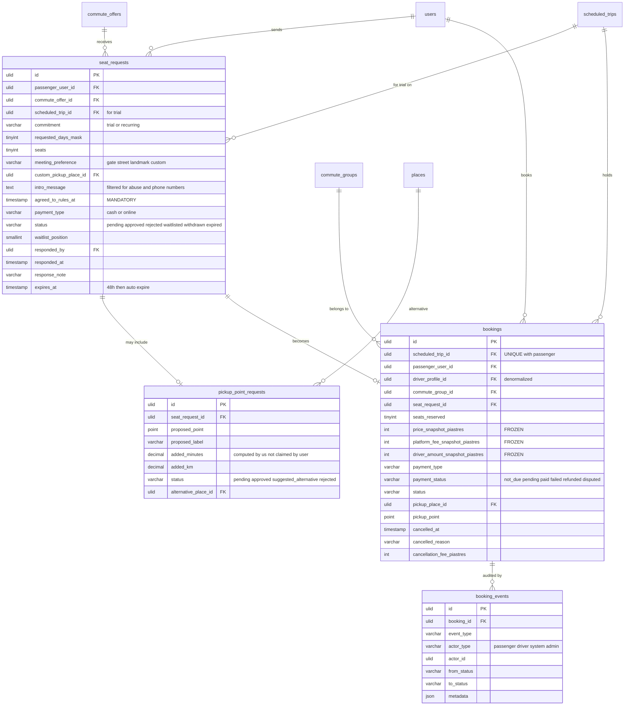

## آلة حالة الحجز

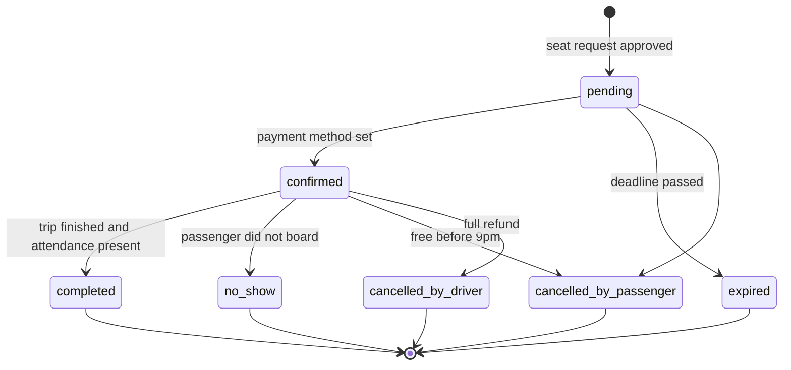

> 🔴 القيد `UNIQUE (scheduled_trip_id, passenger_user_id)` هو خط الدفاع التاني ضد
> الحجز المزدوج — القفل هو الأول.

---

# 10. مجموعة ⑧ — المجموعات

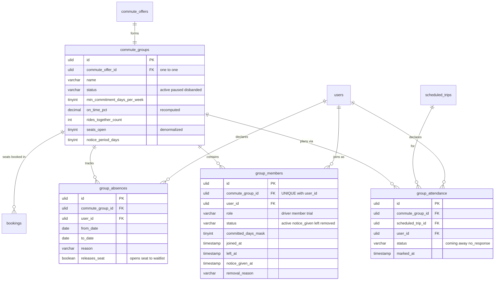

> ⚠️ **متخلطش بين `group_attendance` و `attendance`:**
> - `group_attendance` = **إعلان مسبق** ("أنا جاية بكرة") — بيساعد السائقة تخطط
> - `attendance` (مجموعة ⑩) = **الحضور الفعلي** يوم الرحلة — بيحدد الفاتورة

---

# 11. مجموعة ⑨ — الفلوس

```mermaid
erDiagram
    users ||--o{ payment_methods : saves
    bookings ||--o{ payments : "charged by"
    payment_methods ||--o{ payments : "used in"
    payments ||--o{ refunds : "refunded by"
    payments ||--o{ driver_fee_ledger : "settles debt via"
    driver_profiles ||--o{ driver_fee_ledger : owes
    driver_profiles ||--|| driver_balances : "projected into"
    driver_profiles ||--o{ payouts : receives
    admin_users ||--o{ payouts : releases
    admin_users ||--o{ refunds : approves

    payment_methods {
        ulid id PK
        ulid user_id FK
        varchar provider "paymob"
        varchar provider_token "TOKEN never card number"
        varchar type "card wallet instapay"
        char last4 "display only"
        varchar brand
        varchar wallet_phone_masked
        boolean is_default
        date expires_at
        timestamp deleted_at
    }
    payments {
        ulid id PK
        ulid booking_id FK
        ulid user_id FK
        ulid payment_method_id FK "null for cash"
        varchar payment_type "cash or online"
        varchar provider
        varchar provider_ref
        int amount_piastres
        int platform_fee_piastres
        int driver_amount_piastres
        varchar type "charge refund partial_refund"
        varchar status "pending authorized captured failed refunded settled_offline"
        varchar idempotency_key UK "DOUBLE CHARGE GUARD"
        timestamp authorized_at
        timestamp captured_at
        varchar failure_code
        timestamp confirmed_by_driver_at "cash only"
        tinyint retry_count
    }
    payment_webhooks {
        ulid id PK
        varchar provider
        varchar event_id UK "replay guard"
        varchar event_type
        json payload "raw as received"
        boolean signature_valid "verified BEFORE processing"
        timestamp processed_at
        varchar processing_error
    }
    driver_fee_ledger {
        ulid id PK
        ulid driver_profile_id FK
        ulid booking_id FK
        varchar type "fee_due fee_settled adjustment write_off"
        int amount_piastres "positive owes negative paid"
        int balance_after_piastres "running total for audit"
        ulid settled_from_payment_id FK
        varchar note
    }
    driver_balances {
        ulid driver_profile_id PK_FK
        int outstanding_fee_piastres "PROJECTION of ledger"
        int lifetime_earnings_piastres
        timestamp last_settled_at
        boolean is_blocked_from_publishing
        varchar block_reason
        timestamp reconciled_at "daily drift check"
    }
    payouts {
        ulid id PK
        ulid driver_profile_id FK
        date period_start
        date period_end
        int amount_piastres
        varchar method "instapay wallet bank"
        varchar status "pending cleared on_hold blocked released"
        varchar provider_transfer_ref
        timestamp completed_at
        ulid released_by FK
    }
    refunds {
        ulid id PK
        ulid payment_id FK
        int amount_piastres "sum cannot exceed payment"
        varchar reason
        varchar status "pending approved processed rejected"
        ulid approved_by FK
        varchar provider_ref
    }
```

## مسار الفلوس — الحالتين

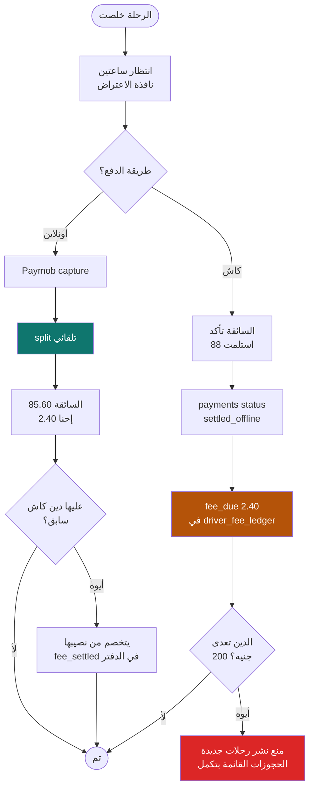

> 🔒 **`driver_fee_ledger` هو مصدر الحقيقة الوحيد للدين.** جدول `driver_balances`
> نسخة محسوبة للسرعة، و job يومي بيقارن `SUM(amount_piastres)` بالعمود
> ويبلّغ فورًا لو اختلفوا.

---

# 12. مجموعة ⑩ — الرحلة الحية

```mermaid
erDiagram
    scheduled_trips ||--o| trip_sessions : "executed as"
    bookings ||--|| attendance : "tracked by"
    trip_sessions ||--o{ trip_locations : records
    trip_sessions ||--o{ trip_wait_timers : "waits via"
    bookings ||--o{ trip_wait_timers : "for"
    users ||--o{ attendance : "confirmed by"

    trip_sessions {
        ulid id PK
        ulid scheduled_trip_id FK "one to one"
        timestamp started_at
        timestamp completed_at
        varchar current_status "preparing en_route at_pickup in_progress completed emergency"
        int distance_travelled_meters
        int duration_seconds
        timestamp deviation_detected_at "route deviation alert"
        int deviation_distance_meters
        timestamp last_location_at "gps dropout detection"
    }
    attendance {
        ulid booking_id PK_FK
        varchar status "pending present late passenger_no_show driver_no_show"
        timestamp checked_in_at
        timestamp checked_out_at
        varchar confirmed_by "driver per D18"
        ulid confirmed_by_user_id FK
        timestamp confirmed_at
        boolean gps_corroborated "supporting evidence only"
        decimal gps_confidence
        timestamp disputed_at "24 hour window"
        varchar dispute_reason
        varchar dispute_resolution "upheld overturned refunded"
        ulid dispute_resolved_by FK
    }
    trip_locations {
        ulid id PK
        ulid trip_session_id FK
        decimal lat
        decimal lng
        smallint accuracy_meters
        smallint speed_kmh
        timestamp recorded_at "DEVICE time not receive time"
        date purge_after "mandatory retention limit"
    }
    trip_wait_timers {
        ulid id PK
        ulid trip_session_id FK
        ulid booking_id FK
        timestamp started_at
        smallint grace_seconds "300 from settings"
        smallint extended_seconds
        varchar outcome "arrived no_show driver_left"
    }
```

## تدفق الموقع — ليه مش مباشرة في MySQL

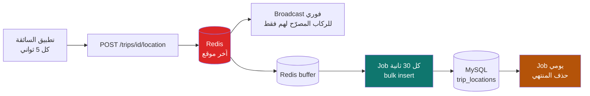

> 🔴 **الحساب:** 500 سائقة نشطة × كل 5 ثواني = **100 كتابة/ثانية**.
> لو كتبت كل نقطة مباشرة في MySQL، الداتابيز هتقع في أول يوم زحمة.

---

# 13. مجموعة ⑪ — التقييم والثقة

```mermaid
erDiagram
    bookings ||--o{ ratings : "reviewed in max 2"
    users ||--o{ ratings : writes
    users ||--o{ ratings : "receives"
    ratings ||--o{ rating_tags : "tagged with"
    ratings ||--o{ review_reports : "reported by"
    users ||--o| trust_scores : "scored as"

    ratings {
        ulid id PK
        ulid booking_id FK "UNIQUE with reviewer"
        ulid reviewer_user_id FK
        ulid reviewed_user_id FK
        varchar direction "passenger_to_driver or driver_to_passenger"
        tinyint stars "1 to 5"
        text comment "abuse filtered"
        timestamp visible_at "NULL means HIDDEN double blind"
        timestamp edit_deadline_at
        timestamp edited_at
        timestamp deleted_at "soft for audit"
        varchar moderation_status "clean flagged hidden"
    }
    rating_tags {
        ulid id PK
        ulid rating_id FK
        varchar tag "safe_driving on_time clean_car great_company"
    }
    trust_scores {
        ulid user_id PK_FK
        tinyint score "INTERNAL never exposed"
        varchar public_tier "new trusted highly_trusted"
        json components
        timestamp computed_at
    }
    review_reports {
        ulid id PK
        ulid rating_id FK
        ulid reporter_id FK
        varchar reason
        varchar status
        ulid resolved_by FK
    }
```

## آلية الـ Double-Blind

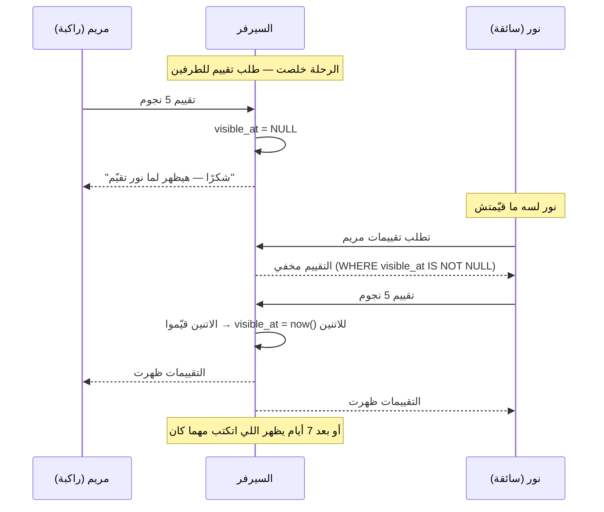

---

# 14. مجموعة ⑫ — الأمان

```mermaid
erDiagram
    users ||--o{ emergency_contacts : "trusts"
    trip_sessions ||--o{ live_shares : "shared via"
    users ||--o{ live_shares : creates
    emergency_contacts ||--o{ live_shares : "shared with"
    users ||--o{ safety_events : triggers
    trip_sessions ||--o{ safety_events : "context for"
    safety_events ||--o| sos_events : "detailed by"
    users ||--o{ incidents : reports
    users ||--o{ incidents : "reported in"
    bookings ||--o{ incidents : "arises from"
    incidents ||--o{ incident_evidence : "supported by"
    admin_users ||--o{ incidents : "assigned to"
    users ||--o{ blocked_users : blocks
    corridors ||--o{ escort_windows : "protected by"

    emergency_contacts {
        ulid id PK
        ulid user_id FK
        varchar name
        varchar phone_e164
        varchar relationship
        boolean auto_share_trips
        boolean is_guardian "elevated during emergency"
        timestamp verified_at
    }
    live_shares {
        ulid id PK
        ulid trip_session_id FK
        ulid user_id FK
        varchar token_hash "32 byte random hashed"
        ulid shared_with_contact_id FK
        timestamp expires_at "ends with trip plus grace"
        timestamp revoked_at
        int view_count
        timestamp last_viewed_at
    }
    safety_events {
        ulid id PK
        varchar type "sos discreet_alert live_share incident escort_armed admin_intervention"
        ulid user_id FK
        ulid trip_session_id FK
        ulid booking_id FK
        varchar severity "low medium high critical"
        json metadata
        timestamp occurred_at "event time not insert time"
    }
    sos_events {
        ulid id PK
        ulid safety_event_id FK
        smallint countdown_seconds "accidental tap guard"
        timestamp cancelled_at
        boolean is_discreet "SILENT no sound no vibration"
        timestamp first_touch_at "THE key ops metric"
        ulid responder_admin_id FK
        varchar resolution "false_alarm resolved escalated_police"
        point location_at_trigger
    }
    incidents {
        ulid id PK
        ulid booking_id FK
        ulid trip_session_id FK
        ulid reporter_user_id FK
        ulid reported_user_id FK
        varchar category "harassment unsafe_driving identity_mismatch payment no_show lost_item"
        varchar severity
        text description
        varchar status "open under_review escalated resolved closed"
        ulid assigned_admin_id FK
        timestamp sla_due_at
        varchar resolution
        timestamp resolved_at
    }
    incident_evidence {
        ulid id PK
        ulid incident_id FK
        varchar file_path "private encrypted"
        varchar kind
        varchar file_hash "chain of custody"
        date purge_after
    }
    blocked_users {
        ulid id PK
        ulid blocker_user_id FK "UNIQUE with blocked"
        ulid blocked_user_id FK
        varchar reason
    }
    escort_windows {
        ulid id PK
        ulid corridor_id FK
        timestamp starts_at "auto arms 9pm"
        timestamp ends_at "5am"
        int trips_covered
        ulid armed_by FK
        boolean is_auto
    }
```

> 🔒 `safety_events` و `incident_evidence` **مايتحذفوش أبدًا** (غير بسياسة الاحتفاظ
> المعلنة). ديه سجلات ممكن تحتاجها في تحقيق حقيقي.

---

# 15. مجموعة ⑬ — التواصل

```mermaid
erDiagram
    users ||--o{ notifications : receives
    users ||--o{ notification_preferences : configures
    bookings ||--o| conversations : "opens on confirm"
    commute_groups ||--o{ conversations : "group chat"
    conversations ||--o{ messages : contains
    users ||--o{ messages : sends

    notifications {
        ulid id PK
        ulid user_id FK
        varchar type
        varchar title
        text body
        json data "deep link payload"
        varchar channel "push sms in_app email"
        varchar category "booking payment trip safety marketing"
        timestamp read_at
        timestamp sent_at
        varchar failed_reason
    }
    notification_preferences {
        ulid id PK
        ulid user_id FK
        varchar category
        varchar channel
        boolean enabled "safety category CANNOT be disabled"
    }
    conversations {
        ulid id PK
        ulid booking_id FK
        ulid commute_group_id FK
        timestamp opened_at "on booking confirm"
        timestamp closed_at "after trip plus grace"
        varchar status
    }
    messages {
        ulid id PK
        ulid conversation_id FK
        ulid sender_user_id FK
        text body
        timestamp read_at
        varchar flagged_reason
        boolean contains_contact_info "phone exchange detection"
        timestamp deleted_at
    }
```

---

# 16. مجموعة ⑭ — الأدمن والتحليلات

```mermaid
erDiagram
    admin_users ||--o{ admin_actions : performs
    admin_users }o--o{ roles : "assigned"
    roles }o--o{ permissions : grants
    admin_users ||--o{ support_tickets : "assigned to"
    users ||--o{ support_tickets : opens
    admin_users ||--o{ platform_settings : updates

    admin_users {
        ulid id PK
        varchar name
        varchar email UK
        varchar password_hash
        varchar mfa_secret "MANDATORY"
        timestamp mfa_confirmed_at
        varchar status
        timestamp last_login_at
        varchar last_login_ip_hash
    }
    admin_actions {
        ulid id PK
        ulid admin_id FK
        varchar action
        varchar entity_type
        ulid entity_id
        json old_value
        json new_value
        varchar reason "mandatory for sensitive actions"
        varchar ip_hash
        varchar user_agent_hash
    }
    support_tickets {
        ulid id PK
        ulid user_id FK
        varchar category
        varchar priority
        varchar status
        ulid assigned_admin_id FK
        timestamp sla_due_at
        varchar related_entity_type
        ulid related_entity_id
    }
    platform_settings {
        varchar setting_key PK
        json setting_value
        varchar value_type
        varchar description
        ulid updated_by FK
    }
    feature_flags {
        varchar flag_key PK
        boolean enabled
        tinyint rollout_percentage
        json audience_filter
    }
    analytics_events {
        ulid id PK
        ulid user_id FK "nullable"
        varchar session_id
        varchar event_name
        varchar entity_type
        ulid entity_id
        json metadata "NO personal data"
        timestamp occurred_at
    }
    recommendation_cache {
        ulid id PK
        ulid user_id FK
        ulid commute_offer_id FK
        tinyint score
        json reason_codes
        timestamp expires_at
    }
    demand_heatmap_cells {
        ulid id PK
        varchar cell_geohash "precision 6 approx 1.2km"
        date cell_date
        tinyint hour_bucket
        int demand_count "min 5 before display"
        int supply_count
    }
```

> 🔒 **`admin_actions` غير قابل للتعديل على مستوى صلاحيات MySQL:**
> ```sql
> GRANT SELECT, INSERT ON rafeeq.admin_actions TO 'rafeeq_app'@'%';
> -- بدون UPDATE ولا DELETE
> ```

---

# 17. خريطة العلاقات العابرة بين المجموعات

الجداول اللي بتعبر حدود المجموعات — دي أهم نقاط الترابط في النظام:

| من (جدول) | إلى (جدول) | المجموعة | النوع | السبب |
|---|---|---|---|---|
| `driver_profiles.user_id` | `users.id` | ③ → ① | 1:0..1 | السائق شخص قبل ما يكون سائق |
| `user_verifications.reviewed_by` | `admin_users.id` | ② → ⑭ | N:1 | مين وافق |
| `commute_offers.vehicle_id` | `vehicles.id` | ⑤ → ③ | N:1 | العرض محتاج عربية معتمدة |
| `commute_offers.corridor_id` | `corridors.id` | ⑤ → ④ | N:1 | الانتماء لمسار معروف |
| `commute_locations.place_id` | `places.id` | ⑤ → ④ | N:0..1 | نقطة معروفة أو حرة |
| `seat_requests.passenger_user_id` | `users.id` | ⑦ → ① | N:1 | |
| `bookings.commute_group_id` | `commute_groups.id` | ⑦ → ⑧ | N:1 | الحجز بينضم لمجموعة |
| `bookings.driver_profile_id` | `driver_profiles.id` | ⑦ → ③ | N:1 | **مكرر عمدًا** لتسريع استعلامات السائقة |
| `payments.booking_id` | `bookings.id` | ⑨ → ⑦ | N:1 | |
| `driver_fee_ledger.driver_profile_id` | `driver_profiles.id` | ⑨ → ③ | N:1 | الدين على السائق مش على الحجز |
| `trip_sessions.scheduled_trip_id` | `scheduled_trips.id` | ⑩ → ⑤ | 1:1 | |
| `attendance.booking_id` | `bookings.id` | ⑩ → ⑦ | 1:1 | |
| `ratings.booking_id` | `bookings.id` | ⑪ → ⑦ | N:1 (حد أقصى 2) | |
| `incidents.booking_id` | `bookings.id` | ⑫ → ⑦ | N:0..1 | البلاغ ممكن يكون بدون حجز |
| `live_shares.trip_session_id` | `trip_sessions.id` | ⑫ → ⑩ | N:1 | |
| `conversations.booking_id` | `bookings.id` | ⑬ → ⑦ | 1:0..1 | |
| `admin_actions.entity_id` | *(متعدد)* | ⑭ → الكل | polymorphic | **مفيش FK** — بيشاور على أي جدول |

## الجداول اللي مالهاش FK خارج نفسها

| الجدول | ليه |
|---|---|
| `otp_challenges` | بتتعمل قبل ما نعرف إن الرقم له حساب |
| `route_cache` | طبقة كاش خالصة، بتتنضّف بحرية |
| `platform_settings` / `feature_flags` | إعدادات عامة |
| `demand_heatmap_cells` | مجمّعة ومجهّلة الهوية عمدًا |
| `analytics_events` | `user_id` اختياري وبدون قيد — عشان نقدر نحذف المستخدم بدون ما نكسر التحليلات |

---

# 18. سياسات الحذف والاحتفاظ

القاعدة اللي على كل FK لازم تتحدد صراحة — الافتراضي في Laravel مش دايمًا صح.

| الجدول | عند حذف الأب | سياسة الاحتفاظ | ملاحظة |
|---|---|---|---|
| `devices` | `CASCADE` | — | |
| `sessions` | `CASCADE` | — | |
| `otp_challenges` | — | حذف بعد 7 أيام | job تنظيف |
| `security_events` | `SET NULL` | **24 شهر** | مايتحذفش مع المستخدم |
| `user_consents` | `RESTRICT` | **دائم** | دليل قانوني |
| `identity_documents` | `CASCADE` | **90 يوم بعد المغادرة** | `purge_after` إلزامي |
| `driver_profiles` | `RESTRICT` | دائم | مالوش لازمة يتحذف |
| `vehicles` | `RESTRICT` | دائم | مرتبطة بحجوزات |
| `verification_logs` | `RESTRICT` | **دائم** | 🔒 |
| `commute_offers` | `RESTRICT` | أرشفة بعد سنة | |
| `scheduled_trips` | `RESTRICT` | **أرشفة بعد 6 شهور** | أسرع جدول نموًا |
| `bookings` | `RESTRICT` | **7 سنين** | سجل مالي |
| `booking_events` | `CASCADE` | مع الحجز | 🔒 |
| `payments` | `RESTRICT` | **7 سنين** | إلزام ضريبي |
| `driver_fee_ledger` | `RESTRICT` | **دائم** | 🔒 مصدر الحقيقة |
| `payment_webhooks` | — | 90 يوم | |
| `trip_locations` | `CASCADE` | ⚠️ **30–90 يوم** | قرار خصوصية مطلوب |
| `attendance` | `CASCADE` | مع الحجز | |
| `ratings` | `RESTRICT` | دائم (حذف ناعم) | |
| `safety_events` | `SET NULL` | **دائم** | 🔒 |
| `incidents` | `RESTRICT` | **7 سنين** | 🔒 |
| `incident_evidence` | `CASCADE` | حسب `purge_after` | 🔒 |
| `messages` | `CASCADE` | 12 شهر | |
| `notifications` | `CASCADE` | 90 يوم | |
| `admin_actions` | `RESTRICT` | **24 شهر** | 🔒 |
| `analytics_events` | `SET NULL` | 24 شهر | مجهّل |

## حذف الحساب — إزاي بيشتغل

```mermaid
flowchart TB
    REQ["المستخدم بيطلب حذف حسابه"] --> CHK{"عليه التزامات؟"}
    CHK -->|"حجوزات قادمة"| BLOCK1["ارفض — لازم تلغيها الأول"]
    CHK -->|"دين كاش"| BLOCK2["ارفض — لازم تسدد"]
    CHK -->|"بلاغ أمان مفتوح"| BLOCK3["تعليق لحد ما يتقفل"]
    CHK -->|"لا"| SOFT["pending_deletion<br/>مهلة 30 يوم للتراجع"]
    SOFT --> ANON["بعد 30 يوم — التجهيل:"]
    ANON --> A1["phone → deleted_ULID<br/>يفك قيد UNIQUE"]
    ANON --> A2["full_name public_first_name<br/>email photo → NULL"]
    ANON --> A3["حذف: المستندات · الأجهزة<br/>الجلسات · وسائل الدفع"]
    ANON --> A4["يفضل: bookings payments<br/>ratings incidents<br/>مربوطين بـ user_id بس"]

    style BLOCK1 fill:#DC2626,color:#fff
    style BLOCK2 fill:#DC2626,color:#fff
    style BLOCK3 fill:#DC2626,color:#fff
    style ANON fill:#B45309,color:#fff
```

> ⚠️ **التوازن:** حق المستخدم في المحو مقابل الالتزام القانوني بالاحتفاظ بالسجل المالي.
> الحل: **تجهيل مش حذف** — الحجز والدفع بيفضلوا، بس مالهمش اسم ولا رقم.

---

# 19. ترتيب الـ Migrations

الترتيب ده إجباري عشان الـ FKs — كل مجموعة بتعتمد على اللي قبلها.

```
01  organizations
02  users
03  otp_challenges
04  devices
05  sessions
06  security_events
07  user_consents
──────────────────────────── ① خلصت
08  admin_users + roles + permissions      ← بدري عشان reviewed_by
09  user_verifications
10  identity_documents
11  trust_scores
──────────────────────────── ② خلصت
12  driver_profiles
13  vehicles
14  vehicle_documents
15  verification_logs
──────────────────────────── ③ خلصت
16  places
17  corridors
18  corridor_stats
19  route_cache
──────────────────────────── ④ خلصت
20  commute_offers
21  commute_locations
22  commute_schedules
23  commute_rules
24  scheduled_trips
──────────────────────────── ⑤ خلصت
25  commute_groups
26  group_members
──────────────────────────── ⑧ جزئيًا (محتاجة قبل bookings)
27  commute_demands
28  saved_searches
29  match_scores
30  match_notifications
──────────────────────────── ⑥ خلصت
31  seat_requests
32  pickup_point_requests
33  bookings
34  booking_events
──────────────────────────── ⑦ خلصت
35  group_attendance
36  group_absences
──────────────────────────── ⑧ خلصت
37  payment_methods
38  payments
39  payment_webhooks
40  driver_fee_ledger
41  driver_balances
42  payouts
43  refunds
──────────────────────────── ⑨ خلصت
44  trip_sessions
45  attendance
46  trip_locations
47  trip_wait_timers
──────────────────────────── ⑩ خلصت
48  ratings
49  rating_tags
50  review_reports
──────────────────────────── ⑪ خلصت
51  emergency_contacts
52  blocked_users
53  safety_events
54  sos_events
55  live_shares
56  incidents
57  incident_evidence
58  escort_windows
──────────────────────────── ⑫ خلصت
59  notifications
60  notification_preferences
61  conversations
62  messages
──────────────────────────── ⑬ خلصت
63  admin_actions
64  support_tickets
65  platform_settings
66  feature_flags
67  analytics_events
68  recommendation_cache
69  demand_heatmap_cells
──────────────────────────── ⑭ خلصت
```

**⚠️ لاحظ:** `admin_users` جاية رقم 08 مش في الآخر — لأن `user_verifications.reviewed_by`
بتشاور عليها. لو أجّلتها، هتضطر تعمل migration تانية تضيف الـ FK.

**⚠️ ولاحظ:** `commute_groups` مقسومة — الجدولين الأساسيين قبل `bookings`،
والحضور والغياب بعدهم.

---

# 20. القيود الحرجة — قائمة فحص

كل قيد هنا بيمنع بق حقيقي. لازم يبقى في الـ migration **وليه اختبار**.

| # | القيد | بيمنع |
|---|---|---|
| 1 | `UNIQUE (users.phone_e164, deleted_at)` | حسابين بنفس الرقم · ويسمح بإعادة التسجيل بعد الحذف |
| 2 | `UNIQUE (user_verifications: user_id, type)` | نوع توثيق مكرر |
| 3 | `UNIQUE (driver_profiles.user_id)` | ملفين سائق لشخص واحد |
| 4 | `UNIQUE (vehicles.plate_normalized)` | نفس العربية عند سائقين |
| 5 | `UNIQUE (vehicles: driver_profile_id, active_flag)` | أكتر من عربية نشطة |
| 6 | `UNIQUE (scheduled_trips: commute_offer_id, trip_date)` | 🔴 التوليد المكرر |
| 7 | `UNIQUE (bookings: scheduled_trip_id, passenger_user_id)` | 🔴 الحجز المزدوج |
| 8 | `UNIQUE (payments.idempotency_key)` | 🔴 الخصم المزدوج |
| 9 | `UNIQUE (payment_webhooks.event_id)` | 🔴 إعادة تشغيل الـ webhook |
| 10 | `UNIQUE (group_members: commute_group_id, user_id)` | عضوية مكررة |
| 11 | `UNIQUE (ratings: booking_id, reviewer_user_id)` | تقييمين من نفس الشخص |
| 12 | `UNIQUE (blocked_users: blocker, blocked)` | حظر مكرر |
| 13 | `UNIQUE (match_notifications: demand_id, offer_id)` | إشعار نفس العرض مرتين |
| 14 | `CHECK (seats_taken <= seats_total)` | 🔴 مقاعد أكتر من العربية |
| 15 | `CHECK (seats_total <= vehicles.seats)` | *(بـ trigger أو في الـ Action)* |
| 16 | `CHECK (amount = platform_fee + driver_amount)` | 🔴 قرش ضايع |
| 17 | `CHECK (end_date >= start_date)` | جدول مقلوب |
| 18 | `CHECK (stars BETWEEN 1 AND 5)` | تقييم خارج المدى |

---

# 21. الفهارس الحرجة

| الجدول | الفهرس | للاستعلام |
|---|---|---|
| `commute_offers` | `(status, audience, bbox_min_lat, bbox_max_lat, bbox_min_lng, bbox_max_lng)` | 🔴 **البحث** — أهم فهرس |
| `commute_offers` | `(driver_profile_id, status)` | رحلات السائقة |
| `scheduled_trips` | `(departure_at, status)` | رحلات النهارده |
| `scheduled_trips` | `(commute_offer_id, trip_date)` UNIQUE | التوليد |
| `bookings` | `(passenger_user_id, status, created_at)` | رحلاتي |
| `bookings` | `(scheduled_trip_id, status)` | ركاب الرحلة |
| `seat_requests` | `(commute_offer_id, status)` | طلبات معلقة للسائقة |
| `payments` | `(booking_id, status)` | حالة الدفع |
| `payments` | `(status, created_at)` | التسوية |
| `driver_fee_ledger` | `(driver_profile_id, created_at)` | حساب الدين |
| `trip_locations` | `(trip_session_id, recorded_at)` | مسار الرحلة |
| `notifications` | `(user_id, read_at, created_at)` | غير المقروء |
| `places` | `SPATIAL (point)` | البحث القريب |
| `commute_locations` | `SPATIAL (point)` | مسافة المشي |
| `users` | `(gender, account_status)` | الفلترة الصارمة |

---

# 22. أرقام متوقعة بعد سنة

| الجدول | الحجم المتوقع | الملاحظة |
|---|---|---|
| `users` | ~50,000 | |
| `commute_offers` | ~8,000 نشط | العنق لو عدّى 20,000 |
| **`scheduled_trips`** | **~1,300,000** | 🔴 محتاج أرشفة |
| `bookings` | ~2,000,000 | |
| **`trip_locations`** | **~100,000,000** | 🔴 محتاج partitioning + حذف |
| `payments` | ~2,000,000 | |
| `notifications` | ~15,000,000 | حذف بعد 90 يوم |
| `analytics_events` | ~50,000,000 | يفضّل يروح لمخزن منفصل |
| `route_cache` | ~200,000 | صغير وبيوفّر كتير |

---

# 23. الخطوة الجاية

```
✅ المخطط جاهز للمراجعة
⬜ مراجعتك واعتمادك  ← إحنا هنا
⬜ المرحلة 0 — الأساسات (3–5 أيام)
⬜ المرحلة 1 — الـ 69 migration بالترتيب أعلاه
```

**قبل ما نبدأ، محتاج منك:**
1. اعتماد المخطط (أو تعديلات)
2. قرار مدة الاحتفاظ بـ `trip_locations` — 30 ولا 90 يوم؟
3. حد الدين اللي بعده نمنع النشر — 200 ج.م مناسبة؟

---

**نهاية المخطط.**
